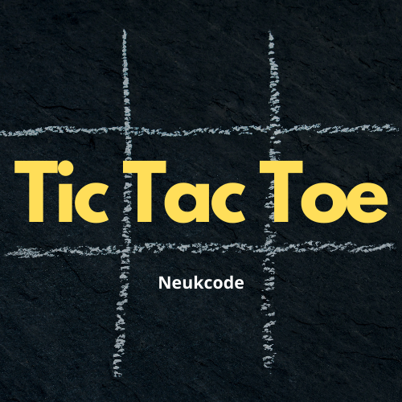

<p align="center">
  <a href="" rel="noopener">
 </a>
</p>

<h3 align="center">Tic Tac Toe</h3>

<div align="center">

[](https://github.com/neukcode/Tic-Tac-Toe/blob/master/LICENSE.md) [](https://github.com/neukcode/Tic-Tac-Toe) [](https://github.com/neukcode/Tic-Tac-Toe)

[](https://github.com/neukcode/Tic-Tac-Toe/stargazers) [](https://github.com/neukcode/Tic-Tac-Toe/network/members) [](https://github.com/neukcode/Tic-Tac-Toe/watchers)

[](https://github.com/neukcode/Tic-Tac-Toe/issues) [](https://github.com/neukcode/Tic-Tac-Toe/issues?q=is%3Aissue+is%3Aclosed) [](https://github.com/neukcode/Tic-Tac-Toe/pulls) [](https://github.com/neukcode/Tic-Tac-Toe/pulls?q=is%3Apr+is%3Aclosed)

[](https://github.com/neukcode/Tic-Tac-Toe) [](https://github.com/neukcode/Tic-Tac-Toe)

[](https://github.com/neukcode/Tic-Tac-Toe/graphs/contributors) [](https://github.com/neukcode/Tic-Tac-Toe/graphs/commit-activity) [](https://github.com/neukcode/Tic-Tac-Toe/discussions) [](https://twitter.com/neukcode?ref_src=twsrc%5Etfw) [](https://twitter.com/intent/tweet?screen_name=neukcode&ref_src=twsrc%5Etfw)

</div>

---

<p align="center"> A Simple Tic Tac Toe game in Python
    <br> 
</p>

## 📝 Table of Contents

- [About](#about)
- [Getting Started](#getting_started)
- [Built Using](#built_using)
- [Authors](#authors)
- [Examples](#examples)

## 🧐 About <a name = "about"></a>

A Simple Tic Tac Toe game in Python.

## 🏁 Getting Started <a name = "getting_started"></a>

- clone project
  ```
  git clone https://github.com/neukcode/Tic-Tac-Toe
  ```
  ```
  cd Tic-Tac-Toe/
  ```
- run
  ```
  python3 ttt.py
  ```

## ⛏️ Built Using <a name = "built_using"></a>

- [Python](https://www.python.org/)

## ✍️ Authors <a name = "authors"></a>

- [@harshraj8843](https://github.com/harshraj8843)

## Examples <a name = "examples"></a>


1. ```
    Computer Input (0) =>  4

    - - - 
    0 - - 
    - - - 

    User Input (1) => 1

    1 - - 
    0 - - 
    - - - 

    Computer Input (0) =>  5

    1 - - 
    0 0 - 
    - - - 

    User Input (1) => 6

    1 - - 
    0 0 1 
    - - - 

    Computer Input (0) =>  2

    1 0 - 
    0 0 1 
    - - - 

    User Input (1) => 8

    1 0 - 
    0 0 1 
    - 1 - 

    Computer Input (0) =>  3

    1 0 0 
    0 0 1 
    - 1 - 

    User Input (1) => 7

    1 0 0 
    0 0 1 
    1 1 - 

    Computer Input (0) =>  9

    1 0 0 
    0 0 1 
    1 1 0 
    ```

2. ```
    Computer Input (0) =>  1

    0 - - 
    - - - 
    - - - 

    User Input (1) => 2

    0 1 - 
    - - - 
    - - - 

    Computer Input (0) =>  4

    0 1 - 
    0 - - 
    - - - 

    User Input (1) => 3

    0 1 1 
    0 - - 
    - - - 

    Computer Input (0) =>  7

    0 1 1 
    0 - - 
    0 - - 


    *****************************

    ******* Computer Won ********

    *****************************
    ```
